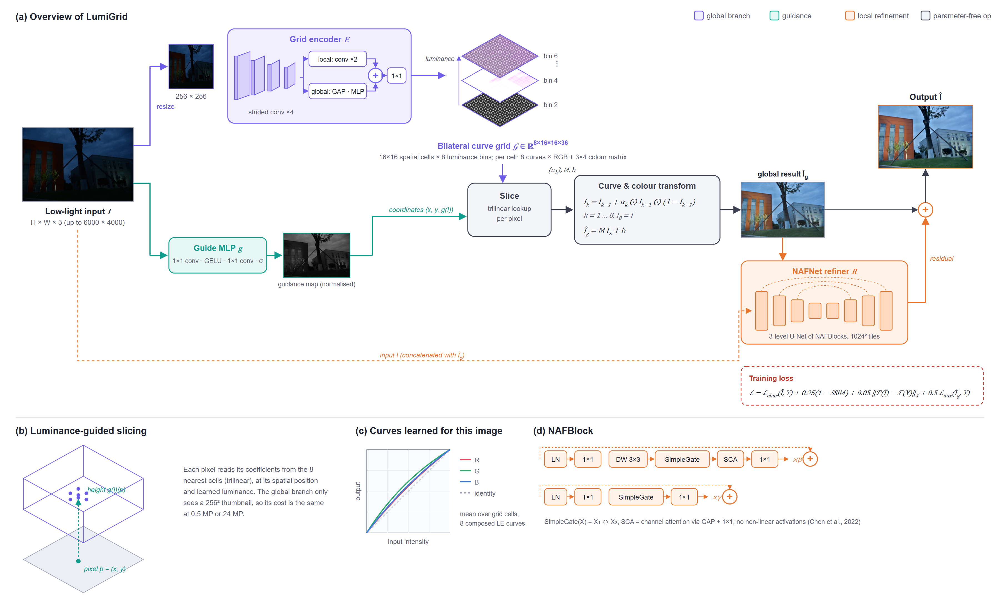
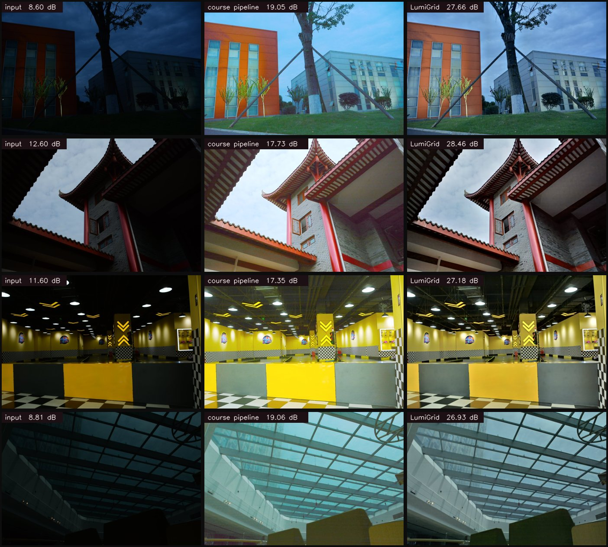

# LumiGrid

**Luminance-guided curve grids for low-light image enhancement.**

LumiGrid brightens dark photos by predicting a small 3-D *bilateral grid of light-enhancement curves* from a thumbnail of the whole image, slicing it at full resolution, and then cleaning up noise and detail with a lightweight NAFNet refiner. It keeps the interpretable curve formulation of Zero-DCE, but learns it with supervision, gives it scene-level context, and lets different luminance layers of the same region follow different curves.



*(a) A grid encoder reads a 256×256 thumbnail and predicts a 16×16×8 bilateral grid of Zero-DCE curves and colour matrices (three of its eight luminance layers are drawn, coloured by the transform each cell actually predicts for this image); a pointwise guide network gives each pixel its luminance coordinate, the grid is sliced trilinearly at full resolution, and a NAFNet refiner adds a residual. (b) Slicing. (c) The composed curves learned for this image. (d) The NAFBlock used in the refiner. All thumbnails are real intermediate results of the released model. Vector version: [architecture.svg](assets/architecture.svg).*



*Held-out NTIRE 2025 test images: dark input · the original Zero-DCE course pipeline · LumiGrid (PSNR against the reference in each label).*

## Results

Evaluated on **20 held-out pairs of the NTIRE 2025 Low-Light Image Enhancement training set** (none of them used for training or model selection), at full resolution (2992×2000 and 6000×4000), with the **official NTIRE scoring code** (PSNR on 8-bit PNGs, SSIM per RGB channel with Gaussian weights).

| Method | PSNR ↑ | SSIM ↑ | Params |
|---|---:|---:|---:|
| Input (no enhancement) | 10.65 | 0.381 | – |
| Zero-DCE, pretrained weights | 19.00 | 0.682 | 0.08 M |
| Zero-DCE + bilateral filter + gamma + contrast (course pipeline) | 16.48 | 0.742 | 0.08 M |
| Zero-DCE, trained on the same data | 20.91 | 0.717 | 0.08 M |
| **LumiGrid** | **24.57** | **0.840** | 2.07 M |
| **LumiGrid + TTA** (average of 4 flips) | **24.63** | **0.841** | 2.07 M |

- The official validation/test ground truth of the challenge is not public, so these numbers are on a local split and **are not leaderboard results**. For orientation only: the public validation leaderboard ranged from 24.1 dB (median) to 26.5 dB (best) PSNR on a different image set.
- The first three rows are the reproduced baselines: the dark input, the pretrained Zero-DCE, and a Zero-DCE + bilateral filter + gamma + contrast pipeline (an earlier course-project submission this work started from).
- Everything was trained and evaluated on one laptop RTX 4060 (8 GB).

### What each part contributes

| Variant | PSNR ↑ | SSIM ↑ |
|---|---:|---:|
| Zero-DCE network, supervised (full-res convolutions, no scene context) | 20.91 | 0.717 |
| Curve grid only (global branch, no refiner) | 22.85 | 0.768 |
| NAFNet refiner only (no global branch) | 22.85 | 0.833 |
| Full LumiGrid | 24.57 | 0.840 |

The same data and loss take the original Zero-DCE network from 19.00 to 20.91 dB; predicting the curves from scene context as a luminance-guided grid adds another 1.9 dB, and the local refiner adds 1.7 dB and most of the SSIM gain (noise removal). The two branches are complementary: on its own, the refiner reaches the same PSNR as the curve grid alone (22.85 dB) with much better structure (SSIM 0.833 vs 0.768), but it gets the overall brightness and colour wrong more often; giving it the grid's result as a starting point adds 1.7 dB.

## How it works

**1. Global branch: a bilateral grid of curves.** A CNN with local and global pathways reads a 256×256 thumbnail of the entire image and outputs a grid of 16×16 spatial cells × 8 luminance bins. Each cell stores

- 8 iterations of per-channel light-enhancement curves, `LE(x) = x + a·x·(1 − x)` (the Zero-DCE curve, which is monotonic and stays in [0, 1]), and
- a 3×4 colour matrix that corrects colour casts after the curves.

**2. Slicing at full resolution.** Every pixel reads its coefficients by trilinear interpolation at its (x, y) position and a *learned* luminance guide (a per-pixel MLP), then applies them. Because the grid is indexed by luminance as well as position, a bright lamp and the shadow next to it *can* follow different curves, and the cost of the global branch does not grow with image size. In the released model the learned guide spans a fairly narrow band (≈0.46–0.54), so most of the variation it uses is spatial; widening that range (e.g. a guide regulariser) is an obvious next experiment.

**3. Local refinement.** A 3-level NAFNet U-Net takes the input and the sliced result and predicts a residual that removes noise and restores texture. It runs on overlapping 1024×1024 tiles, so a 24-megapixel image fits in 8 GB.

**Training.** 189 training pairs, random 320×320 full-resolution crops (batch 8) whose grid coefficients are sliced at the crop's true position inside the full image, so training and full-image inference see exactly the same transform. Loss: Charbonnier + 0.25·(1 − SSIM) + 0.05·FFT magnitude, plus an auxiliary loss on the global branch; AdamW, one-cycle cosine schedule, 20k iterations (≈2 h on a laptop GPU). 10 further training images are held out for checkpoint selection; the 20 test images are only used for the final numbers above.

## Usage

```bash
pip install -r requirements.txt

# enhance your own photos with the released weights
python scripts/enhance.py night.jpg --out results/enhanced          # add --tta for the 4-flip ensemble, --cpu without a GPU
```

Reproduce training and evaluation (the NTIRE 2025 LLIE data is not redistributed here; obtain it from the challenge page):

```bash
python scripts/prepare_data.py --src /path/to/Train_Low_Light_2025      # caches pairs and writes the fixed split (seed 2025)
python -m lumigrid.train --name lumigrid --iters 20000 --batch 8 --crop 320
python -m lumigrid.train --name global_only --no-local --iters 12000     # ablations: --no-local, --no-global, --arch zerodce
python scripts/eval_test.py lumigrid --tta                               # official metrics on the held-out split
```

`scripts/eval_baselines.py` reproduces the baseline rows; it expects the original Zero-DCE weights (`Epoch99.pth` from [Li-Chongyi/Zero-DCE](https://github.com/Li-Chongyi/Zero-DCE)) at `weights/zerodce_epoch99.pth`.

## Limitations

- Trained on 189 images of one challenge dataset; scenes far from it (extreme sensor noise, heavy motion blur) are out of distribution.
- A handful of training pairs are slightly misaligned, which limits how sharp a pixel-wise loss can make the output.
- The local split is small (20 images), so differences below ~0.2 dB should not be over-read.
- Two test images pull the mean down: one night scene where the reference keeps the sky dark but LumiGrid brightens it (13.5 dB), and one pair whose reference is framed differently from the input (11.9 dB) even though the output looks right.

## Acknowledgements

- C. Guo et al., *Zero-Reference Deep Curve Estimation for Low-Light Image Enhancement*, CVPR 2020 — the curve formulation.
- M. Gharbi et al., *Deep Bilateral Learning for Real-Time Image Enhancement* (HDRNet), SIGGRAPH 2017 — the bilateral-grid idea.
- L. Chen et al., *Simple Baselines for Image Restoration* (NAFNet), ECCV 2022 — the refiner blocks.
- NTIRE 2025 Challenge on Low Light Image Enhancement — data and scoring protocol.

## License

MIT
